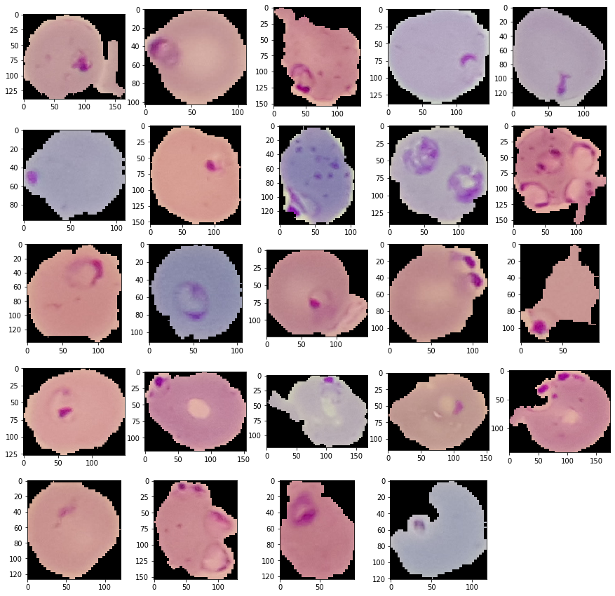

<h1>Detection of Malaria 🦟🦠</h1>

<h3>INTRODUCTION</h3>

<p>Malaria is a life-threatening disease. It’s typically transmitted through the bite of an infected <b>anopheles mosquito</b>. Infected mosquitoes carry the <b>plasmodium parasite</b>. When this mosquito bites you, the parasite is released into your bloodstream. It is considered as an endemic in many parts of the world.</p></n><p>Malaria detection is performed by examining a drop of the patient’s blood, spread out as a “blood smear” (red blood cell) on a microscope slide. This blog focuses on improving malaria detection from such patches segmented from the microscopic images of blood smears by introducing a deep convolutional neural network. Compared to the traditional methods that use tedious hand engineering feature extraction, the proposed method uses deep learning in an end-to-end arrangement that performs both feature extraction and classification directly from the raw segmented patches of the red blood smears.</p>

<h3>RISK FACTOR</h3>

<p>Malaria is commonly associated with poverty and has a major negative effect on economic development. In Africa, it is estimated to result in losses of <b>US$12 billion</b> a year due to increased healthcare costs, lost ability to work, and negative effects on tourism</p>

<h3>SYMPTOMS OF MALARIA</h3>

<p>A malaria infection is generally characterized by the following signs and symptoms:</p><br>
<ul><li>Fever</li><li>Chills</li><li>Headache</li><li>Nausea and vomiting</li><li>Muscle pain and fatigue</li></ul><p>Other signs and symptoms may include:</p><ul><li>Sweating</li><li>Chest or abdominal pain</li><li>Cough</li></ul>

<h3>How is Malaria diagnosed by pathologists?</h3>

<p>Typically Malaria is diagnosed by microscopic examination of blood cells under the supervision of a pathologist. Red blood cells are examined using a microscope using blood films. The pathologists tries to find evidence of Malaria using past domain knowledge. Typically, when a cell is infected with Malaria one can see distorted cell shapes which are also accompanied by certain blunt spots in the cell.</p>

<h3>PROBLEM STATEMENT</h3>

<p>For malaria as well as other microbial infections, manual inspection of thick and thin blood smears by trained microscopists remains the gold standard for parasite detection and stage determination because of its low reagent and instrument cost and high flexibility. Despite manual inspection being extremely low throughout and susceptible to human bias, automatic counting software remains largely unused because of the wide range of variations in brightfield microscopy images. However, a robust automatic counting and cell classification solution would provide enormous benefits due to faster and more accurate quantitative results without human variability; researchers and medical professionals could better characterize stage-specific drug targets and better quantify patient reactions to drugs.</p>

<h2>General Outline</h2>

<p><b>Our code template shall perform the following steps:</b></p>

<ol><li>Importing Libraries</li><li>Preliminary Data Processing.</li><li>Check total number of entries</li><li>Exploratory Data Analysis (EDA).</li></ol>

<h3>Information about the dataset.</h3>

<p>The dataset is downloaded from Kaggle from this link — <a href="https://www.kaggle.com/iarunava/cell-images-for-detecting-malaria">https://www.kaggle.com/iarunava/cell-images-for-detecting-malaria</a>. The dataset was originally taken from the NIH website and uploaded to a Kaggle repository. The dataset contains 27558 cell images. Out of these 27558 images, we have 13779 cell images which are infected by Malaria and an other 13779 images which are uninfected.

<h2>Importing Libraries</h2>

```python
import os
import random

##Imports for Managing Datasets
import numpy as np
import pandas as pd

##Imports for Data Visualization
import matplotlib.pyplot as plt
from matplotlib.image import imread
import seaborn as sns
```

<h2>Preliminary Data Processing</h2>

<p>To start off, we read in our dataset.</p>

```python
##Directory for Parasitized cell images</br>
parasitize_images_dir = '../Malaria_detection/cell_images/Parasitized'</br>

##Directory for Uninfected cell images</br>
uninfected_images_dir = '../Malaria_detection/cell_images/Uninfected'
```

<h2>Check total number of entries</h2>

```python
##lets take a look at the number of images of parasitized cells
parasitize_images_dir = os.listdir(parasitize_images_dir)
len(parasitize_images_dir)
```

Output : 13780

```python
##lets take a look at the number of images of uninfected cells
uninfected_images_dir = os.listdir(uninfected_images_dir)
len(uninfected_images_dir)
```

Output : 13780

<p>The output shows that we have around <b>13780</b> entries in 'parasitize_images_dir' directory & 'uninfected_images_dir' shows that it has <b>13780</b> entries.</p>

<h1>Step2. Exploratory Data Analysis(EDA)</h1>

<h2>Parasitized Images</h2>

<p><b>After setting up the dataset, now we are ready to begin EDA(fun part)</b></p>

<p>Code for checking 25 parasitized images</p>

```python
##lets see a variety of parasitized cells
filenames = random.sample(os.listdir('../Malaria_detection/cell_images/Parasitized') , 25)

##here we will see 25 images of Parasitized cell images
plt.figure(figsize=(15, 15))  # figure size
for i in range(1, len(filenames)):
    row = i
    image = imread('../Malaria_detection/cell_images/Parasitized/' + filenames[i])
    plt.subplot(5, 5, row)
    plt.imshow(image)
plt.show()
```



<p>The above picture clearly shows that in the 25 cell images, we could see blunt spots which means these cells are parasitized.</p>

<h2>Uninfected Images</h2>

<p>Code for checking 25 uninfected images</p>

```python
##lets see a variety of uninfected cells
filenames_ = random.sample(os.listdir('../Malaria_detection/cell_images/Uninfected'), 26)

##here we will see 25 images of Uninfected cell images
plt.figure(figsize=(15, 15))
for i in range(1, len(filenames_)):
    row = i
    image = imread('../Malaria_detection/cell_images/Uninfected' + '/' + filenames_[i])
    plt.subplot(5, 5, row)
    plt.imshow(image)
plt.show()
```


<p>The above pictures are very clear without any spots in it, which says they are not infected.</p>

<h3>Writing a Directory of a single parasitized cell & view using imread</h3>

```python
para_cell = '../Malaria_detection/cell_images/Parasitized/C100P61ThinF_IMG_20150918_144104_cell_163.png'
para_cell
```

```python
plt.imshow(imread(para_cell))
```


<p>We can clearly see a purple colored spot in the cell.</p>

<h3>Writing a Directory of a single uninfected cell & view using imread</h3>

```python
uninfected_cell = '../Malaria_detection/cell_images/Uninfected/C100P61ThinF_IMG_20150918_144104_cell_25.png'
uninfected_cell
```

```python
plt.imshow(imread(uninfected_cell))
```


<p>This image is very clear with no spots in it.</p>

<h3>The last one in EDA is jointplot of parasitized & uninfected cells.</h3>

<h4>Parasitized Cell Images</h4>

```python
dim1_ = []
dim2_ = []

for image_filename in os.listdir('../Malaria_detection/cell_images/Parasitized'):
    if 'Thumbs.db' not in image_filename:
        img = imread('../Malaria_detection/cell_images/Parasitized/' + image_filename)
        d1,d2,colors = img.shape
        dim1_.append(d1)
        dim2_.append(d2)

##'thumbs.db' files are database files containing the small images displayed when you view a folder in Thumbnail view
##we will have to remove them
```

```python
sns.jointplot(dim1_,dim2_)
```


<h4>Uninfected Cell Images</h4>

```python
dim1 = []
dim2 = []

for image_filename in os.listdir('../Malaria_detection/cell_images/Uninfected'):
    if 'Thumbs.db' not in image_filename:
        img = imread('../Malaria_detection/cell_images/Uninfected/' + image_filename)
        d1,d2,colors = img.shape
        dim1.append(d1)
        dim2.append(d2)
```

```python
sns.jointplot(dim1,dim2)
```


```python

```
